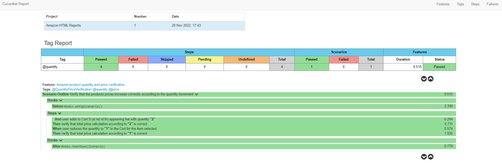
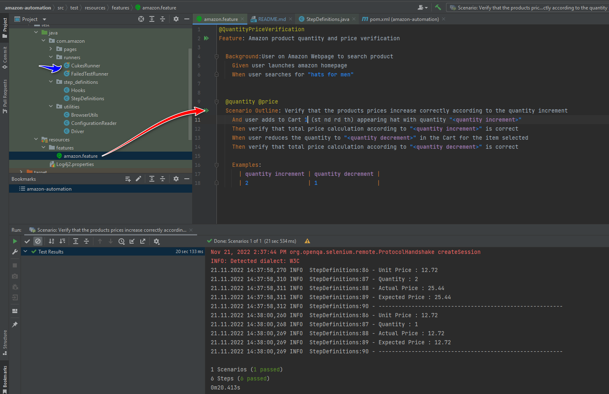

# Cucumber BDD Test Automation Framework


Selenium & Java based `Frontend` and `Backend` automation suite utilising the BDD methodologies of Cucumber and Gherkin
Cancel changes
## Prerequisites

-  JAVA SDK 17
-  Maven
-  Plugins (Cucumber,Gherkin)

### Windows Mac

Intellij IDEA   -> Preferences/Settings   -> Plugins ->  Marketplace -> `Cucumber and Gherkin` for Java

### Set Path Variables

User Variable Path = directory for java sdk 17
Set Maven home in environment Variables

### For Windows
Create the following System variables
- JAVA_HOME = PAth to java sdk
- M2_HOME = Path to maven installation
- MAVEN_HOME = Path to maven installation

### For Windows Edit Path System variable
- Add %M2_HOME%\bin
- Add directory to your chromedriver.exe


## Framework Overview

The cucumber BDD testing framework Using keywords such as Given, When, Then and And, acceptance criteria tests known as feature files can then be broken down into testable steps.
Can be utilized both for UI and Backend Testing

### Cucumber Selenium
Overall testframework leveraging the Cucumber framework with Selenium written in JAVA.

### Feature File
The feature file specifies the steps in BDD language style (`Plain English Language`)

### Utilities Package
In order to keep common methods separate

### Page Object Model
Java class whereby the necessary HTML objects are captured as WebElements to be manipulated by the associated model class to be able to reach and maintain easily


### Reporting plugins
Built-in report generation, whereby Feature files tested are automatically written to Cucumber's own reporting system.

```
To run Report
         mvn clean
         mvn verify => the folders and files will be created as HTML format
```
<ul>
  <li>Cluecumber-report</li>
  <li>Cucumber HTML Report</li>
  <li>Default HTML report</li>
</ul>

### CucumberReport Preview



###To run from features file or CukesRunner




# Test cases in Gherkin format


```

@QuantityPriceVerification
Feature: Amazon product quantity and price verification

  Background:User on Amazon Webpage to search product
    Given user launches amazon homepage
    When user searches for "hats for men"


  @quantity @price
  Scenario Outline: Verify that the products prices increase correctly according to the quantity increment
    And user adds to Cart 1 (st nd rd th) appearing hat with quantity "<quantity increment>"
    Then verify that total price calculation according to "<quantity increment>" is correct
    When user reduces the quantity to "<quantity decrement>" in the Cart for the item selected
    Then verify that total price calculation according to "<quantity decrement>" is correct

    Examples:
      | quantity increment | quantity decrement |
      | 2                  | 1                  |